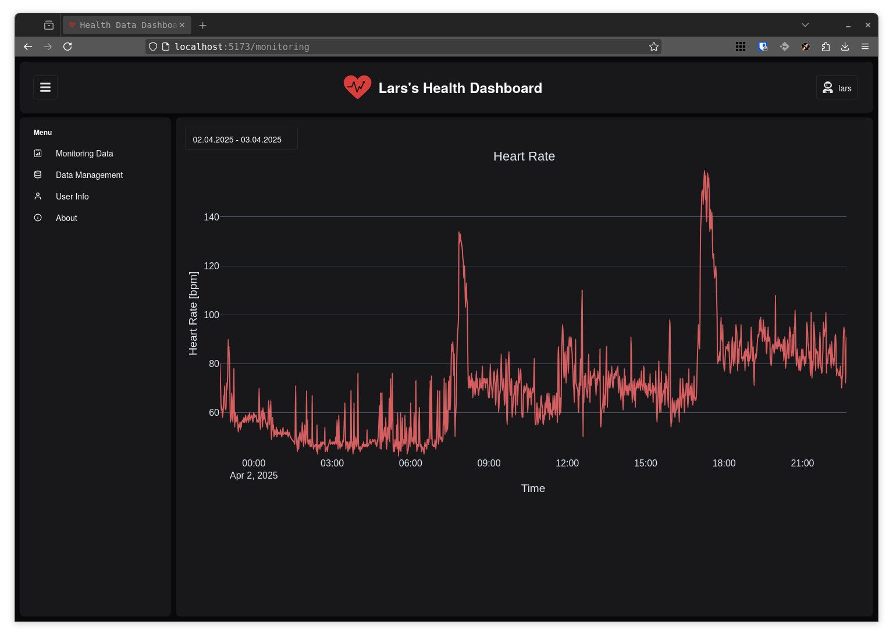

# Health Dashboard
## Current Status
Features:
- [x] Setup FastAPI (including db management)
- [x] Setup React, Chakra UI
- [x] Authentication -> get token from backend for own user from db
- [ ] registration -> create user in db
- [x] get data from Garmin Connect
    - [ ] make it work with multiple users (wait for merge of garminDB)
- [x] display first monitoring data in dashboard with some chart (churetly using plotly)
- [ ] add more monitoring data
    - [ ] monitoring table
    - [ ] respiration rate
    - [ ] steps?
- [ ] add more data ... use summary tables from garminDB
    - [ ] sleep data
    - [ ] heart rate
    - [ ] stress level
    - [ ] body battery
    ...

- [x] basic plotting with plotly
    - [ ] improove date selector -> currently not styled properly
    - [ ] time selection not working at all

# Health Dashboard Project
Playing around with my health data using a reverse engineered Garmin Connect API. I want to create some visualizations and dashboards to track my health data over time. This is just a learning project as I would like to try out some new things like using FastAPI and React to create a web app showing my health data. Could be pretty cool!

To to this I need some way to get my data from Garmin Connect. I have a few options:

## GarminDB
Download and parse data from Garmin Connect or a Garmin watch, FitBit CSV, and MS Health CSV files into and analyze data in Sqlite serverless databases with Jupyter notebooks, [their github](https://github.com/tcgoetz/GarminDB).

The tool allows me to easily configure desired data in a `json` file and then automatically downloads the data upon script execution. This could be automated, pretty cool. But the db layout and data structrue given by the devs of GarminDB, very extensive and may not be the best for what I want to do.

## python-arminconnect
Python 3 API wrapper for Garmin Connect to get activity statistics, [their github](https://github.com/cyberjunky/python-garminconnect).

This is a simple API wrapper that allows me to get data from Garmin Connect. It is has a very detailed `example.py` file that shows how to use the wrapper. This could be cool as I would need to manage the data structure and layout myself. Also the persisting of the data would be up to me. Although I like the idea of the serverless sqlite db, but as this is a learning project I would like to try it by myself.

